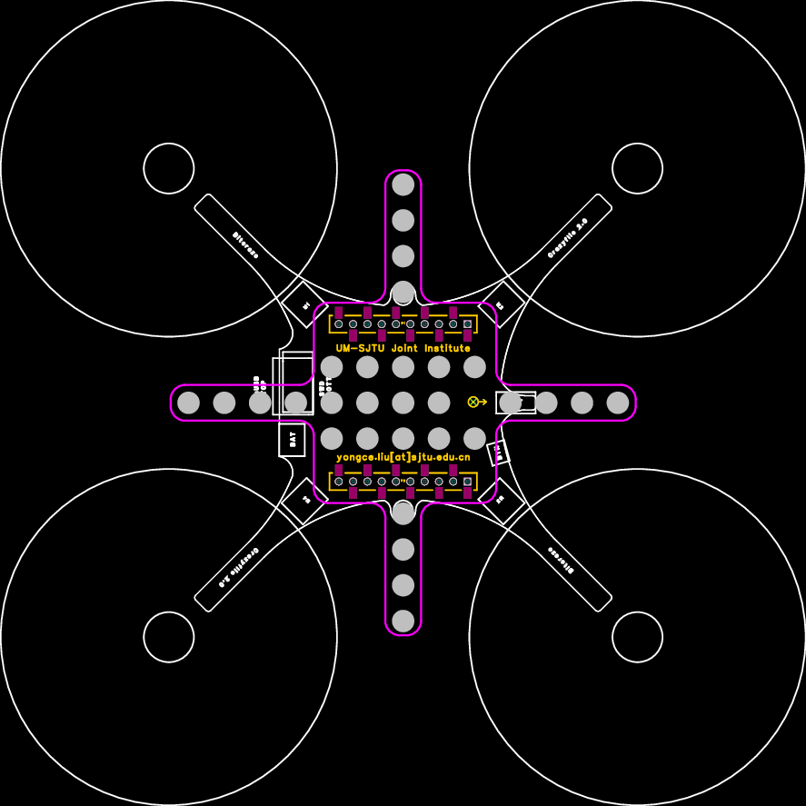

# mocap_marker_deck
- Motion Capture Marker Deck (PCB & Gerber Files) for Crazyflie 2.x.
- The preview is shown as follows.

# Project Inheritance
[crazyflie2-exp-template-electronics](https://github.com/bitcraze/crazyflie2-exp-template-electronics) is a expansion board template for Crazyflie 2.x provided from [Bitcraze](https://bitcraze.io/)

# Note
The PCB is designed by [EasyEDA](https://easyeda.com/).

# Other Links
You can find the customized Active Marker Deck in Repo. [Active-motion-capture-marker-deck](https://github.com/ETH-PBL/Active-motion-capture-marker-deck).
