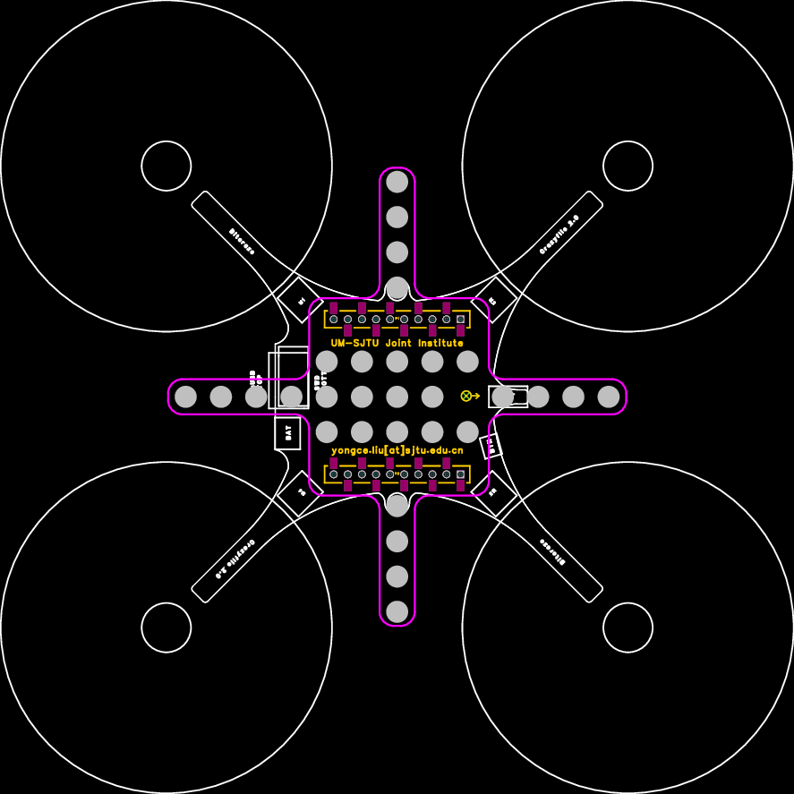
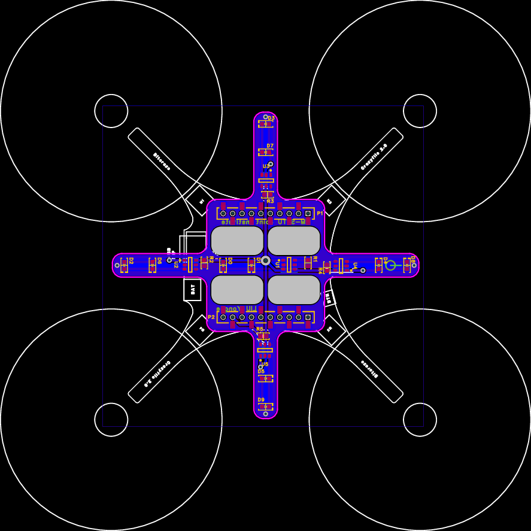

# mocap_marker_deck

- (Active/Passive) Motion Capture Marker Deck (PCB & Gerber Files) for Crazyflie 2.x. The preview is shown as follows.
- Passive
  
- Active
  

# Note

- The PCB is designed by [EasyEDA](https://easyeda.com/).
- [crazyflie2-exp-template-electronics](https://github.com/bitcraze/crazyflie2-exp-template-electronics) is a expansion board template for Crazyflie 2.x provided from [Bitcraze](https://bitcraze.io/)
- You can find the customized Active Marker Deck in Repo. [Active-motion-capture-marker-deck](https://github.com/ETH-PBL/Active-motion-capture-marker-deck).

# Components used
- 0.8mm Height Flat Top Infrared LED / [HIR19-21C/L11/TR8](https://item.szlcsc.com/115820.html)
- Linear LED drivers / [BCR421UW6Q-7](https://item.szlcsc.com/166081.html)
- 20 ohm Resistor / [RC0603JR-0720RL](https://item.szlcsc.com/148964.html)
- 2mm Male deck connector, 1*10 P
- 2mm Female deck connector, 1*10P, Reverse foot position, Surface mount type
