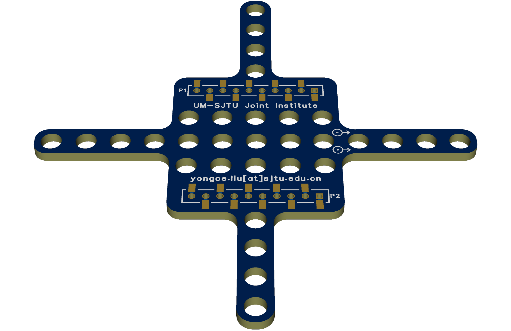

# mocap_marker_deck

## New larger version

- see "./Active_80mm/Gerber_ActiveMocapDeck_80mm.zip"
- I enlarge the previous version with more stable recognition performance and easier to solder components.

### components

- 1206 package Infrared LED, such as [XL-TD3216HIRC-850](https://item.szlcsc.com/6136409.html)
- 1206 package resistor, 100 ohm, such as [1206W4F1000T5E](https://item.szlcsc.com/18589.html)
- Note that you need to select the accurate wavelength for the Infrared LED. In motion capture system, **850nm** for Infrared LED is more widely used.

## previous version

- (Active/Passive) Motion Capture Marker Deck (PCB & Gerber Files) for Crazyflie 2.x. The preview is shown as follows.
- Passive
  
- Active
  

# Note

- The PCB is designed by [EasyEDA](https://easyeda.com/).
- [crazyflie2-exp-template-electronics](https://github.com/bitcraze/crazyflie2-exp-template-electronics) is a expansion board template for Crazyflie 2.x provided from [Bitcraze](https://bitcraze.io/)
- You can find the customized Active Marker Deck in Repo. [Active-motion-capture-marker-deck](https://github.com/ETH-PBL/Active-motion-capture-marker-deck).

# Components used (also see "/Active/BOM...")

- 0.8mm Height Flat Top Infrared LED / [HIR19-21C/L11/TR8](https://item.szlcsc.com/115820.html)
- Linear LED drivers / [BCR421UW6Q-7](https://item.szlcsc.com/166081.html)
- 20 ohm Resistor / [RC0603JR-0720RL](https://item.szlcsc.com/148964.html)
- 2mm Male deck connector, 1*10 P
- 2mm Female deck connector, 1*10P, Reverse foot position, Surface mount type
